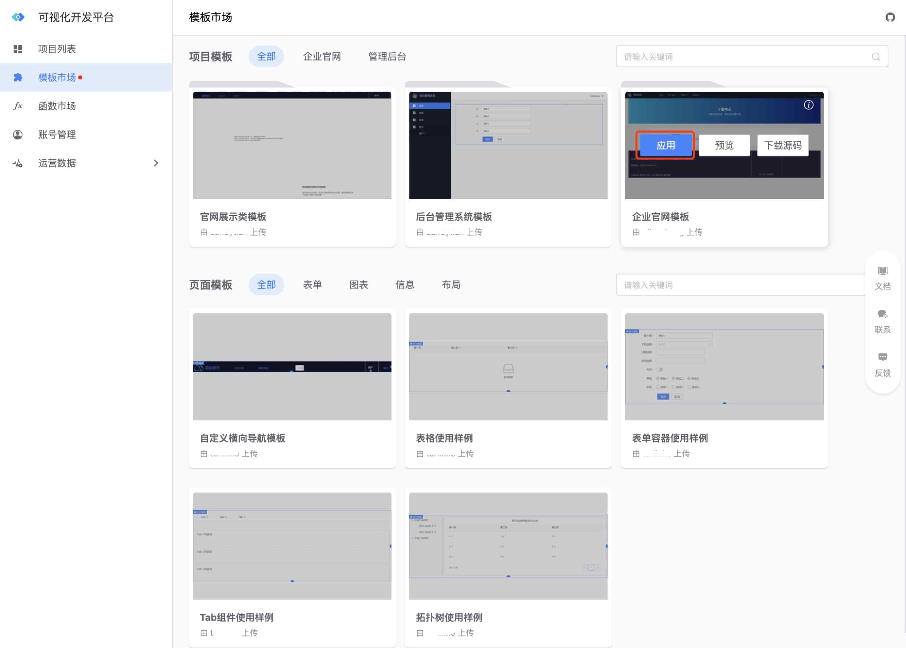
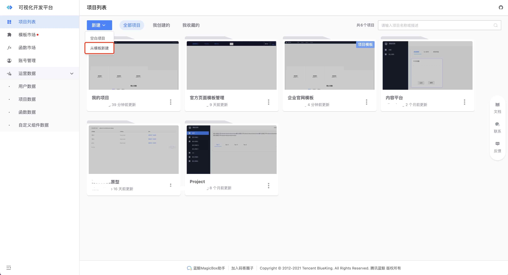
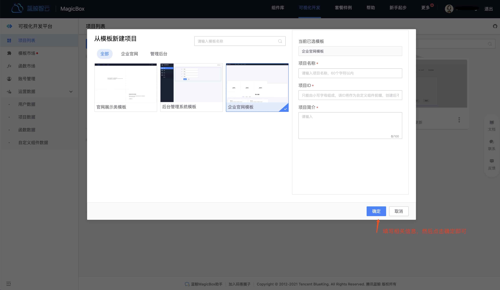
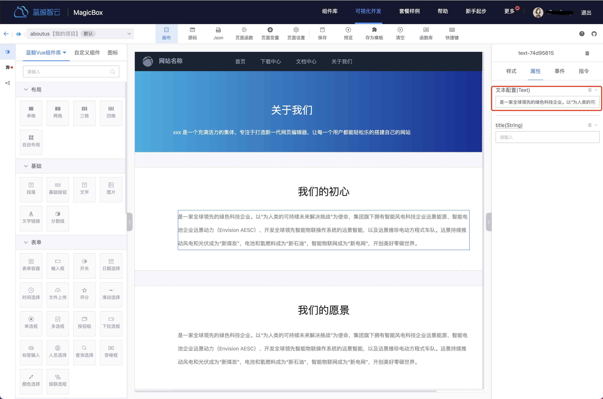
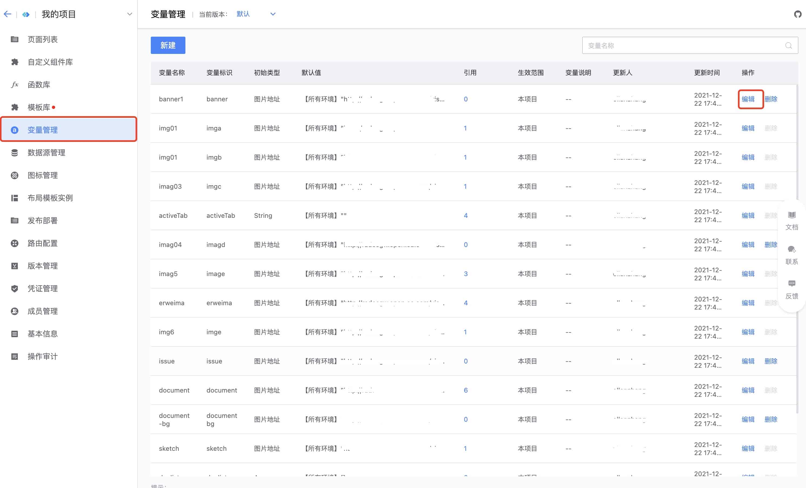
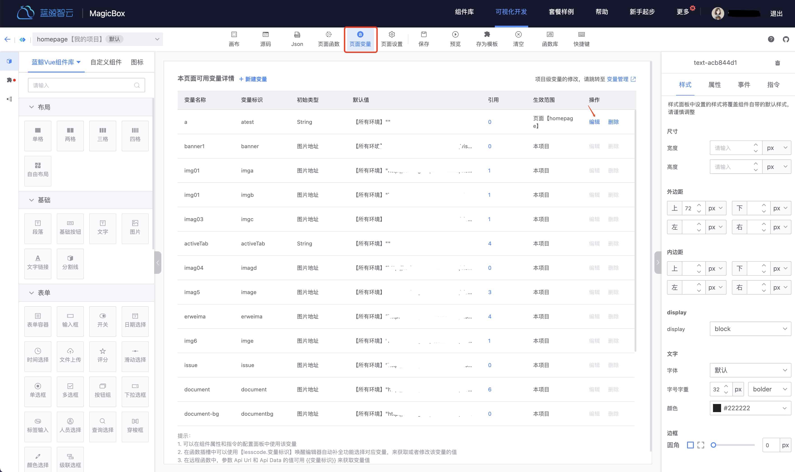
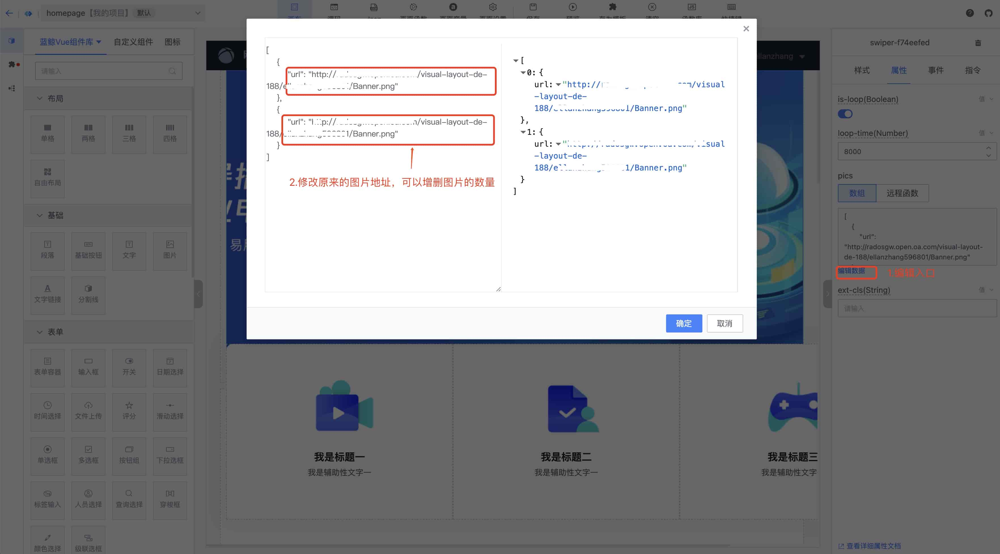

## 项目模板的使用指引
lesscode 提供丰富的项目级模板，包含项目里使用的完整内容，如：函数，变量，数据库等，用户可以直接引用，无需从 0 到 1 进行组装，使用时只需要将对应内容进行修改即可快速完成项目的开发。

### 如何使用项目模板？
使用项目模板有两种方式：一种是通过模板市场添加，另外一种是通过在项目列表页面进行添加。

### 第一种：通过模板市场添加
1.进入模版市场，选择合适的项目模板，然后点击应用
* 应用：可以基于模板创建新的项目
* 下载源码：可以直接下载项目模板源码，进行二次开发
  

{width="80%"}
  

2.填写项目相关信息，点击确定即可
 
 
{width="80%"}
  

### 第二种：在新建项目时，选择通过模板创建
1.创建项目时选择从模板创建
  
  
{width="80%"}
  
  

{width="80%"}
  
  

3.创建完成后，就可以看到项目模板包含的所有页面
  
  
{width="80%"}
  
  

### 步骤3:  如何修改模板内容？
接着就可以将模板信息修改为自己想要的内容：比如文字，变量，图片等容等。

#### 文字内容修改

选择对应的组件，在属性面板进行修改
 
 
{width="80%"}

#### 变量修改

变量根据生效范围分为：全局变量和页面变量，全局变量在项目的每个页面都可以使用，页面变量仅在对应页面生效。

##### 全局变量修改

1.进入项目变量管理界面，点击对应的变量进行编辑，即可实现对使用了该变量的内容进行一键修改
  
  
{width="80%"}

2.修改变量的具体属性
 
  
{width="80%"}

3.在组件的属性面板，也可以更换成新的变量
  
  
{width="80%"}

##### 页面变量修改
1.页面变量，在进入画布编辑的时候，即可在页面当中直接修改。
  
  
{width="80%"}

#### 图片修改
图片的渲染是通过连接 URL 实现的，所以只需要将对应的图片 URL 修改即可，以模板中的 banner 图为例：
1.点选图片，然后修改属性配置里的 URL
  
 
{width="80%"}
  
  
2.如果想使用图片变量里的 URL，可以复制对应图片变量的地址，即可使用
  
 
{width="80%"}
